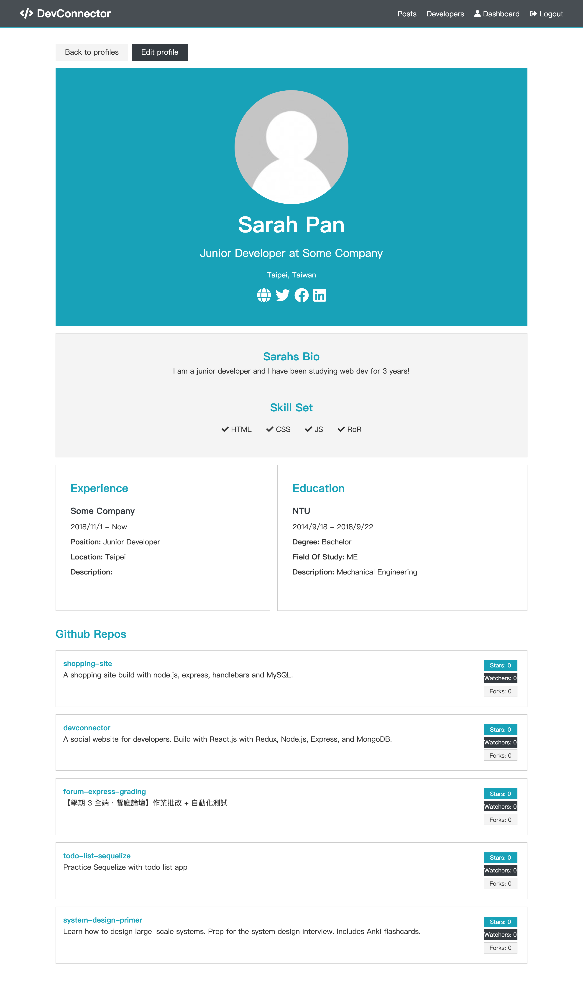

# Developer connector

**A social website build with below tech stack:**

- `React.js` with `Redux` for frontend
- `Node.js` and `Express` for backend
- `MongoDB` for database with `Mongoose` as ODM

**The project is hosted on `Heroku`:**

https://pure-waters-63134.herokuapp.com/

**Play around with below account:**

- email: root@example.com
- password: 12345678

## Features



#### For un-registered users:

- Account registration, login and logout features
- All users can view developers dashboard
- If provided, shows developer's github repo
- Only registered users can view posts

#### For registered users:

- User is able to create and edit profile
- User is able to delete its account
- User is able to view all the posts
- User is able to create posts
- User is able to delete its own posts
- User is able to create comments on posts
- User is able to delete its own comments

## Quick Start

#### 1. Clone this repository

```
git clone git@github.com:johnnychang25678/devconnector.git
```

#### 2. Install server dependencies

```
npm install
```

#### 3. Install client dependecies

```
cd client
npm install
```

#### 4. Add a default.json file in config folder with the following

```
{
  "mongoURI": "<your_mongoDB_Atlas_uri_with_credentials>",
  "jwtSecret": "secret",
  "githubToken": "<yoursecrectaccesstoken>"
}
```

#### 5. Run both Express & React from root

```
npm run dev
```
